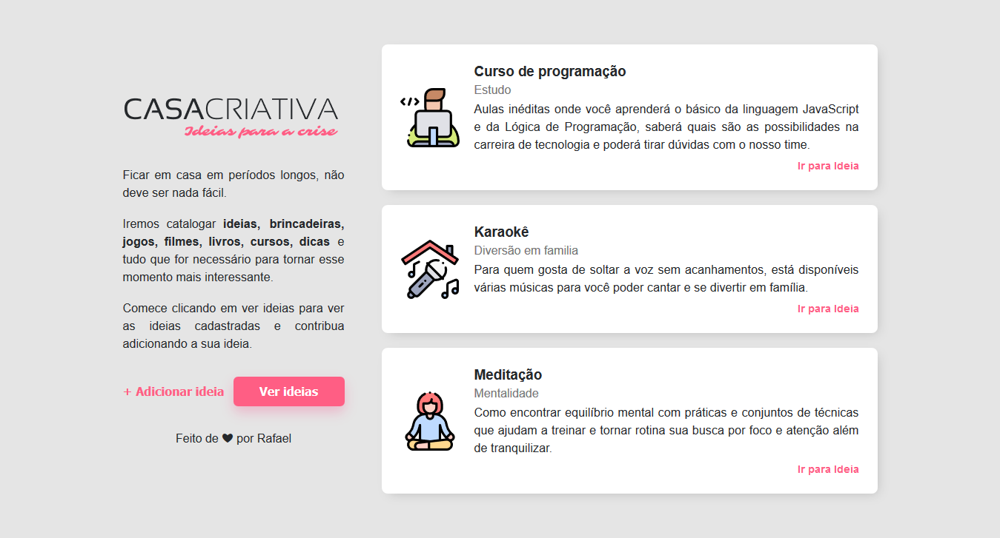

<h1 align="center"> Casa criativa </h1>
 

 

Site feito para treinar meus conhecimentos em flexbox.

Utilizei apenas HTML5 e CSS.

OBS: Apenas copiei o template do Workshop Dev, o site foi feito sem nenhuma consulta ao curso.
